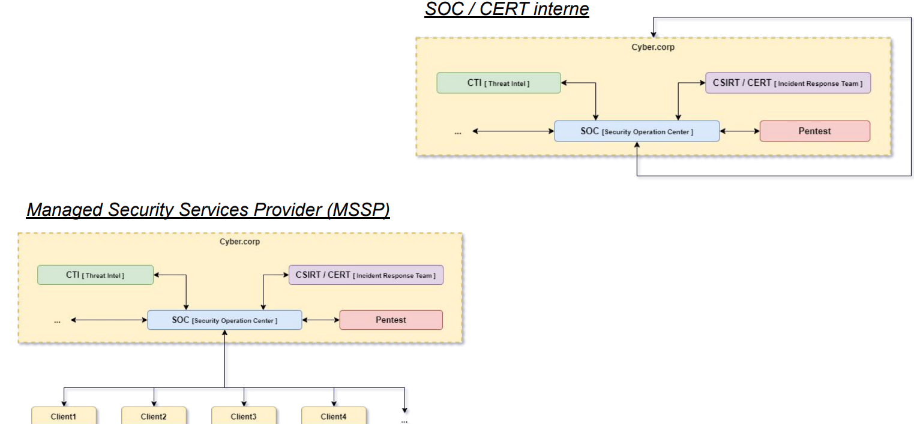

# SOC
- Une constante est **commune** à tous les SOC : son objectif **Détecter un attaquant**
- **L'objectif** d'un SOC est de *détecter, analyser et remédier* aux incidents de cybersécurité à l'aide de **solutions technologiques** et d'un **ensemble de démarches**.

- Question:
    - Pourquoi un SOC est-il nécessaire ?
        - Le coût d'une compromission est plus grand que le coût de la sécurité
        - Obligations légales (OIV)
        - Les solutions préventives ne sont pas suffisantes pour sécuriser un SI
    - Quand se mettre un SOC ? 
        -  Idéalement dès le début de la mise en place d'un système d'information
    - Comment mettre en place un SOC ?
        - De manière itérative
## Phase de vie: 

- Build: 
    - Phase de **conception de la supervision** d'un SI 
        - *Interconnexion* du SI supervisé avec la bulle SOC
        - *Supervision des équipements* de sécurité (centreon)
    - Définition d'une **stratégie de détection**
        - *Équipements de sécurité et journalisation* associée
        - *Jeu de règles de détection* en provenance d'un *catalogue de règles*
    - Définition des *processus*, des *engagements*, de la *matrice de communication*
    - Implémentation:
        - Mise en place de la **chaîne de collecte**
        - Application de la **politique de journalisation**
        - Implémentation du **jeu de règles de détection** et **Tuning**
- VABF: 
    - Vérification du bon fonctionnement des processus définis: **Période de “PRE-RUN”**
    - Validation du jeu de règles de détection et du tunning:
        - Tests unitaires
        - Optionnel : Tests d'intrusion / exercice red team
    - Valider que le SOC est capable de qualifier confortablement l'ensemble des incidents levés

Exemple:

- Politique de journalisation adaptée à la stratégie de détection (et monitorée)
- Chaîne de collecte en place
- Supervision des postes nomades et de l'infrastructure Cloud

- Le PDIS est l'acronyme de Prestataires de Détection d'Incidents de Sécurité

- RUN:
    - Répondre & Améliorer:
        - Répondre à l'incident de sécurité. Proposer des mesures de confinement / remédiations.
        - Participer à l'amélioration de l'hygiène de sécurité du SI supervisé.
    - Détecter: Génération d'incidents de sécurité dans les différentes consoles
    - Prioriser: Identification des incidents prioritaires
    - Investiguer & Qualifier: 
        - Enquêter en se basant sur la télémétrie disponible sur le périmètre.
        - Analyser et qualifier l'incident de sécurité
        - Notifier de façon adéquate.
- Amélioration continue et maintien en condition de détection (MCD)
    - Rétroaction sur la stratégie de détection / méthodes
        - Développement de nouvelles règles
        - Améliorations de règles existantes
        - Modification de la politique de journalisation
        - Déploiement de nouveaux équipements de supervision
    - Adaptation aux expériences / difficultés observées durant le RUN et à l'évolution de la menace et des technologies.
- Maintien en condition opérationnelle:
    - Supervision NOC (Network Operation Center) de l'infrastructure SOC
    - Mise à jour des équipements
    - Debug / interventions en cas de pannes

## Évolution de la maturité du SI et du SOC

- **Conforme** : Le système d'information est correctement configuré afin de *limiter sa surface d'attaque*. Les bonnes pratiques sont respectées (politique de mots de passe, règles de firewall, horaires de connexions…).
- **Préventif** : Un SOC disposant de **moyens de détection** sur le système d'information est en place. Il peut *identifier une tentative de compromission* à l'aide de sondes journalisant l'activité système, réseau et cloud du SI.
- **Réactif** : Le SOC en place dispose de **moyens de réponse** sur le système d'information et peut *contrevenir à une tentative de compromission*. Il dispose de **privilèges** lui permettant d'agir sur les systèmes supervisés et peut **prendre des actions** pour endiguer la menace (réinitialisation des accès utilisateur, blocage de trafic réseau, isolation réseau d'une machine…).
- **Proactif** : Le SOC dispose de **moyens automatisés** permettant, en fonction de l'activité détectée, de *mener des actions visant à contrevenir à une éventuelle menace* (désactivation automatique d'un compte à l'origine d'une activité suspecte…). Le SOC *met activement à jour sa stratégie de détection*.
- ● Prédictif : Le SOC dispose de **moyens de renseignement** sur la cybermenace (CTI) lui permettant de **définir son modèle de menace** et **prendre des actions** de sécurisation préventives. 

## Types et environnement du SOC

- CTI
    - La Threat Intelligence est le processus **d'identification** et **d'analyse des cybermenaces**
    - L'expression **Threat Intelligence** peut désigner les données collectées à propos d'une menace ou le processus de collecte, de traitement et d'analyse de ces données dans le but de mieux comprendre les menaces.
    - La Threat Intelligence consiste à **passer au crible les données**, à les **examiner dans leur contexte** pour repérer les problèmes et **à déployer des solutions** particulières au problème constaté

- Le service de CERT / CSIRT : réponse à incident
    - Centralisation des demandes d'assistance suite aux incidents de sécurité (attaques) sur les réseaux et les systèmes d'informations : **réception des demandes**, **analyse des symptômes** et éventuelle **corrélation des incidents** ;
    - **Traitement** des alertes et **réaction** aux attaques informatiques : analyse technique, échange d'informations avec d'autres CERT, contribution à des études techniques spécifiques ;
    - **Établissement** et **maintenance** d'une base de donnée des vulnérabilités;
    - Prévention par diffusion d'informations sur les précautions à prendre pour minimiser les risques d'incident ou au pire leurs conséquences ;
    - Coordination éventuelle avec les autres entités (hors du domaine d'action) : centres de compétence réseaux, opérateurs et fournisseurs d'accès à Internet, CERT nationaux et internationaux
    - En cas de forte suspicion ou de détection avérée d'une intrusion sur le périmètre supervisé, le SOC est généralement amené à **déclencher l'intervention de l'équipe de réponse à incident** qui sera chargée de monter une cellule de crise et d'accompagner le client dans la posture à adopter face à l'adversaire. Le SOC peut évidemment être impliqué dans la réponse à incident en soutien aux opérations pour déployer de nouvelles règles de détection contextuelles permettant de tracer précisément les actions adverses. Il en va de même pour l'équipe CTI qui peut être chargée d'identifier l'adversaire et de fournir un panel d'indicateurs et de comportements liés à l'activité de l'adversaire.
- Le service d'audit / Pentest
    - Le service d'audit ou de Pentest peut interagir avec les équipes SOC dans le cadre d'une opération offensive.

## Acteur de la supervision SOC

- Acteur Interne:
    - Analyste SOC (N1 / N2 / N3) : chargé du triage (priorisation) et du traitement des incidents de sécurité remonté dans les différentes consoles des périmètres monitorés; de leur qualification (vrai positif / faux positif). Il est aussi proactif dans *l'amélioration de la stratégie de détection et moteur du maintien en condition de détection (MCD)*. Le découpage en différents niveau (N1 / N2 / N3) permet traditionnellement le découpage des analystes en fonction de leur niveau d'expertise et des tâches qui leur sont confiées - il
    est typiquement utilisé pour effectuer des escalades au niveau supérieur en fonction de la difficulté / criticité de l'investigation. Encore une fois, la segmentation en niveau et son implémentation est particulière à chaque SOC.
    - Architecte SOC : chargé de la *conception de la stratégie de détection* au commencement de *la phase de BUILD*. Il est chargé de *fournir les **plans de construction*** de la supervision du périmètre SOC, ces documents seront la base de la validation lors de la VABF.
    - Intégrateur SOC : chargé *d'implémenter la supervision conçue par l'architecte*; de déployer et configurer les équipements de sécurité et de supervision, ainsi que d'implémenter la chaîne de collecte
    - Administrateur : chargé de *l'administration du SI du SOC*, avec notamment le *maintien en condition opérationnelle (MCO)* des équipements permettant la supervision.
    - Direction du SOC : Management et *décisions stratégiques du SOC*.
    - Project Manager : chargé du suivi et de l'accompagnement des différents projets sur les périmètres SOC (nouveau build, intégration de nouvelles technologies, amélioration de la stratégie de détection …)
    - Service Delivery Manager : chargé de *vérifier le bon fonctionnement* du service, interface avec le client et l'analyste pour les diverses demandes du client. Peut aussi être chargé d'accompagner le client dans l'identification des problématiques de sécurité les plus impactantes sur son SI.
- Acteur Externe:
    - Analyste CTI : chargé du suivi et de *l'analyse de l'évolution de la menace*, *fournit des indicateurs* et peut *participer à leur déploiement* en détection sur le(s) périmètre(s).
    - Incident Responder : *déclenché en cas de forte suspicion (ou de certitude) de compromission* pour - entre autres - élaborer une cellule de crise et apporter les premières mesures de réponse ainsi que la posture à adopter face à l'adversaire.
    - Pentester : peut être engagé dans *un exercice offensif* ayant pour but *d'entraîner et valider* les capacités de détection du SOC.
    - Service Juridique : peut être impliqué lors d'une réponse à incident pour interagir avec les autorités judiciaires pour *poursuivre un adversaire identifié* lors d'une intrusion.
    - Service Commercial : chargé de vendre les prestations dans le cas d'une activité de supervision externe
    - Autorités Judiciaires : permettent la constitution d'un dossier judiciaire pour sanctionner un adversaire identifié selon la législation applicable dans le cadre d'une intrusion.
- Acteurs chez le bénéficiaire :
    - RSSI / DSI : responsable de la sécurité du périmètre supervisé, chargé de la prise de *décision stratégique pour la défense du SI*.
    - Équipes SSI : équipe sécurité en interaction ou faisant partie intégrante du SOC, chargé de la sécurité du SI de façon globale.
    - Administrateurs : chargés de l'administration du SI, réalisent des actions critiques nécessitant souvent une validation après détection par le SOC.
    - SSI Business : équipe chargée de l'intégration, de l'administration et de la sécurisation des solutions sur lesquelles reposent le cœur de métier de l'entreprise - il peut s'agir de solutions particulièrement spécifiques et dont l'hygiène de sécurité laisse à désirer (faute de choix).

## Architecture fonctionnelle SOC

- SOC interne:
    - Coût financier (Infrastructure, ressources humaines, veille)
    - Attirer les compétences et les conserver
    - Sensibilisation et formation interne
- SOC MSSP:
    - Coût financier (Infrastructure, ressources humaines, veille) - moindre qu'un SOC dédié car
    réparti entre les différents clients
    - Attirer les compétences et les conserver
    - Eviter le sur-mesure et uniformiser les processus
    - Sensibilisation & formation client
    - Connaître les SI supervisés

# Modélisation des ménaces:

## Types des ménages
- Les ransomwares : l'objectif est de **chiffrer les données** présentent sur un système d'information, et *forcer les victimes à payer pour récupérer l'accès à leurs données*. La motivation principale est financière.
- Les malwares : l'objectif est **d'obtenir un contrôle sur un environnement**. Ce n'est souvent pas l'objectif final d'un attaquant, mais plutôt une étape intermédiaire.
- Le cryptojacking : l'objectif est **d'abuser d'un système d'information pour générer du profit**, par exemple via le minage de cryptomonnaie.
- Les compromissions emails : cette catégorie regroupe à la fois **le vol des emails** pour récupérer des informations, ou **l'usage des boîtes mails** pour pénétrer dans un système d'information (phishing).
- La collecte de données : l'objectif de l'attaquant est de **récupérer des informations sensibles**, parce qu'elles sont sensibles ou pour nuire à sa victime (extorsion, diffamation, désinformation).
- La disponibilité et l'intégrité : l'objectif est de **nuire à la disponibilité d'un service**, ou à son intégrité.
- Le contrôle de la chaîne d'approvisionnement : l'objectif est de **prendre le contrôle d'un prestataire** ou sous-traitant pour atteindre (ou attaquer) de manière indirecte une cible.
- La désinformation : l'objectif est de **propager une fausse information** (les réseaux sociaux et leurs
utilisateurs sont les victimes).

## Advanced Persistent Threat
- On parle d'Advanced Persistent Threat pour désigner des attaquants utilisant des techniques *sophistiquées et furtives* pour accéder à un système et y rester pendant une période prolongée.
- Les techniques d'attaques utilisées sont plus complexes qu'à l'ordinaire, et les actions sont exécutées manuellement contre une cible spécifique.

## La kill chain

- Initial foothold : Le premier objectif d'un adversaire dans son opération est généralement de récupérer et **pérenniser un accès au réseau interne** de l'organisation ciblée
    - Reconnaissance:  l'adversaire **récupère un maximum d'information** sur sa cible au travers de scan externes passifs et/ou actifs pour identifier les assets exposés publiquement, récupérer une mailing list,…
    - Weaponization: l'adversaire **met en place l'infrastructure dédiée à l'opération offensive**, et prépare son panel d'outils et de codes malveillants. Il planifie son attaque en fonction des informations qu'il a récolté.
    - Delivery: l'adversaire identifie et utilise un moyen de **délivrer une charge initiale** à sa cible que ce soit par **l'exploitation d'une vulnérabilité** sur des assets exposés publiquement ou en ciblant un ou plusieurs utilisateurs ou une savante combinaison des deux.
    - Persistence: l'adversaire **pérennise son accès** en usant de divers mécanismes assurant la *persistance de ses codes malveillants* après redémarrage de la machine compromise (tâches planifiées, installation de services, …).
    - Defense Evasion: s'il le peut, l'adversaire tentera d'identifier et de **désactiver les moyens de détection/protections** déployés sur le poste compromis avant de continuer son activité
    - Exécution - l'adversaire **exécute du code** arbitraire sur une ressource distante lui permettant de pivoter / de récupérer des mots de passes / d'établir une nouvelle persistance, …
    - Credential Access - l'adversaire **récupère des credentials légitime** lui permettant *d'effectuer des actions en impersonnant un utilisateur*. Lui permettant alors *d'élever ses privilèges* ou simplement de *rendre ses actions plus discrètes.*
    - Lateral Movement - l'adversaire est en mesure de **se déplacer vers une nouvelle partie du réseau interne** où il peut itérer ses *activités de propagation*; ou accède enfin au réseau d'intérêt depuis lequel il pourra *mener à bien son objectif*.
- Action on objectives
    - Access: l'adversaire **accède à la ressource** (machine, compte privilégié, documents, …)
    - Collection: l'adversaire **énumère, identifie et rassemble les données** sur lesquelles il souhaite agir
    - Exfiltration - si nécessaire, l'adversaire **exifltre les données ciblées sur son infrastructure**
    - Impact - si c'est son objectif, l'adversaire peut impacter tout ou partie du SI

## Pyramid of Pain

- Hash Values: SHA1, MD5 or other similar hashes that correspond to specific suspicious or malicious files. Often used to provide **unique references** to specific samples of malware or to files involved in an intrusion.
- IP Addresses: It's, um, an IP address. Or maybe a netblock.
- Domain Names: This could be either a domain name itself (e.g., "evil.net") or maybe even a sub- or sub-sub-domain (e.g., "this.is.sooooo.evil.net")
- Network Artifacts: Observables caused by adversary activities on your *network*. Technically speaking, every byte that flows over your network as a result of the adversary's interaction could be an artifact, but in
practice this really means those pieces of the activity that might tend to distinguish malicious activity from that of legitimate users. Typical examples might be URI patterns, C2 information embedded in network
protocols, distinctive HTTP User-Agent or SMTP Mailer values, etc.
- Host Artifacts: Observables caused by adversary activities on one or more of your *hosts*. Again, we focus on things that would tend to distinguish malicious activities from legitimate ones. They could be registry
keys or values known to be created by specific pieces of malware, files or directories dropped in certain places or using certain names, names or descriptions or malicious services or almost anything else that's
distinctive.
- Tools: Software used by the adversary to accomplish their mission. Mostly this will be things they bring with them, rather than software or commands that may already be installed on the computer. This would include
utilities designed to create malicious documents for spearphishing, backdoors used to establish C2 or password crackers or other host-based utilities they may want to use post-compromise.
- Tactics, Techniques and Procedures (TTPs): How the adversary goes about accomplishing their mission, from reconnaissance all the way through data exfiltration and at every step in between. "Spearphishing" is a
common TTP for establishing a presence in the network. "Spearphishing with a trojaned PDF file" or "... with a link to a malicious .SCR file disguised as a ZIP" would be more specific versions. "Dumping cached
authentication credentials and reusing them in Pass-the-Hash attacks" would be a TTP. Notice we're not talking about specific tools here, as there are any number of ways of weaponizing a PDF or implementing Pass-the-Hash.

### TTP
TTP signifie Tactiques, Techniques et Procédures. Ce terme est utilisé pour décrire les comportements, processus, actions et stratégies utilisés par un adversaire. 
- Tactiques : Objectifs généraux, niveau le plus élevé de description.
- Techniques : Méthode utilisée par la menace pour parvenir à son objectif, description plus détaillée des actions de l'adversaire.
- Procédures : Description étape par étape de l'action, niveau de détail le plus précis. 

## Mitre ATT&CK

MITRE ATT&CK est un framework qui cherche à documenter les tactiques et les techniques des attaquants, ainsi que les manières d'y répondre (détection, mitigation). Ce travail de documentation a pour objectif de faciliter le travail des différentes équipes de sécurité :
- les pentesteurs : tester des tactiques/techniques connues pour être utilisées par des APT (Advanced Persistent Threat)
- Les défenseurs : mettre en place les moyens de détection et de protection nécessaires contre ce type de menace.

1. Détecter les **comportements** des attaquants. En effet, conformément à la Pyramid of pain, les indicateurs
traditionnels tels que les IP, les hashs, les clés de registres, les fqdn, etc, sont facilement modifiables par les
adversaires et de ce fait ne sont efficaces que durant une période limitée. Ils ne représentent pas comment
les attaquants interagissent avec le système : leur véritable signature.
2. Le modèle de cycle de vie d'une attaque qui ne **correspond pas** à la réalité. La Cyber Kill Chain et les autres
modèles représentant le cycle de vie d'une attaque ont un niveau d'abstraction tel qu'il n'était pas trivial de
lier les TTP (Tactics, Techniques, and Procedures) à ces modèles.
3. **Applicabilité** à un environnement réel. Les TTPs ont en effet besoin d'être basés sur de vrais incidents et de
réelles analyses pour s'assurer qu'elles sont applicables à des environnements en production.
4. Une **taxonomie** commune, pour comparer les différents groupes d'adversaires. 

## Autres framework
- FW de simulation d'attaques : Caldera, Atomic Red Team, Metta
- FW de détection : Sigma, Yara, Snort, Suricata
- FW de réponse à incident : TheHive, MISP, ELK, Splunk
- FW de Threat Intelligence : MISP, STIX, TAXII, OpenCTI

# Stratégie de détection
La stratégie de détection constitue la **mise en cohérence** de l'ensemble des **éléments** contribuant à la détection d'activités malveillantes sur un périmètre. Tous les éléments suivants doivent être considérés suivant une approche holistique :
- Stratégie de **journalisation** et de collecte des événements de sécurité
- **Jeu de règles** de détection
- **Outils & technologies**
- **Architecture**, **positionnement stratégique** & **configuration des équipements** de sécurité
- **Processus** organisationnels
- **Spécificités** et **contraintes** inhérentes au périmètre à monitorer

## Les événements : définitions
- Les événements (logs)
    - Occurrence identifiée de l'état d'un système, d'un service ou d'un réseau.
    - Trace d'une activité, du changement d'état d'un système d'un service, d'un réseau, ou des données qu'ils traitent.
- Les événements liés à la sécurité de l'information
    - Occurrence identifiée de l'état d'un système, d'un service ou d'un réseau indiquant une violation possible de la politique de sécurité de l'information ou un échec des mesures de sécurité ou encore une situation inconnue jusqu'alors et pouvant relever de la sécurité de l'information.
## Contraints pour les formats d'événements
- Plusieurs **formats** de fichier :
    - Binaire, Texte, JSON, XML, Syslog, CSV, CLF, ELF, CEF, etc.
    - Format syslog imprécis - RFC 5424 et 3164 - Ne définit pas le corps du message.
- **Interprétables**
    - Compréhensibles par un humain pour qu'il puisse les lire
    - Structurés pour une machine afin qu'elle puisse les traiter facilement (champs fixes, grammaire définie) - Pas toujours le
cas (exemple : log linux)
- Horodatage (et unicité)
    - Les événements doivent être horodatés - Mais pas de format de date universel. Problématique de l'UTC.
    - Les machines doivent avoir des horloges synchronisées
- Source **identifiable**
    - Être en capacité de déterminer l'origine de l'événement (la source qui l'a produit)
- Minimiser les **données sensibles**
    - Données personnelles
    - Données sensibles
    - Contraintes réglementaires
    - Préférer les données techniques

Quels événements doivent/peuvent être journalisés ?
- Les événements nécessaires à une conformité réglementaire
- Les événements nécessaires au maintien en conditions opérationnelles
- Les événements métiers
- Les événements liés à la sécurité du système d'information
    - Pour faire de la détection
        - La stratégie de journalisation est une composante primordiale de la stratégie de détection
    - Pour faire de l'investigation

La stratégie de journalisation d'événements liés à la sécurité doit être faite en fonction de la stratégie
de détection et des besoins d'investigation.
- Qu'est-ce que je veux détecter ?
    - Les événements nécessaires à la détection
    - Les événements nécessaires à l'investigation et la qualification des incidents levés
- Quelles sont mes capacités de stockage et de traitement ?
    - Augmentation des capacités ou limitation des événements collectés (et donc du scope de détection)
- Quelle est ma politique de rétention ?
    - Conservation des événements en local sur les machines (mobilisable en Réponse à Incident) ou dans un outil de management de log (investigation)

## Les sources d'événements
- Systèmes d’exploitation
    - Journalisation système
    - EDR/EPP/Antivirus (HIDS)
- Équipements réseaux
    - Routeur, Switch, Access Point
    - Serveur réseau (DNS/NTP/VPN/Proxy)
    - Firewall, WAF
    - NIDS
- Serveurs d’identité et authentification
    - Solutions IAM
    - Active Directory
- Solutions applicatives métier
    - Serveurs métiers
    - Logiciels métiers
- Solutions génériques
    - Serveurs de fichiers
    - Sites webs internes
    - etc. etc.
- Environnements Cloud
    - Applicatifs métiers
    - Applicatifs de sécurité

Les sources de logs traditionnelles sont :
- Serveurs Windows 
- Linux 
- DNS
- Firewall 
- Proxy
- Endpoints des administrateurs et des V.I.P (Comité Exécutif, quelques personnes clefs, etc)

Actuellement, les sources de logs *courantes* sont :
- Serveurs Windows - Linux - DNS
- Firewall - Proxy - EDR
- O365 / Workspace - Proxy Cloud - SSO Cloud
Un peu moins fréquentes mais souvent déployées sur des périmètres très maîtrisés (OIV, étatique), on trouve également les sondes réseaux et les sondes OT.
Il est également de plus en plus fréquent de collecter les logs des applications critiques (RH, cœur de métier, etc).

## Les événements Windows
Configurer la génération des événements : **Politique d’audit**
La politique d’audit définit quels événements sont générés par le système d’exploitation dans le **journal Sécurité**. Il s’agit d’un mécanisme inclus dans le fonctionnement du système
d’exploitation.
Les catégories et sous catégories suivantes sont configurables dans la politique d’audit Windows 

Utilisation de la commande auditpol :
- https://morgantechspace.com/2013/10/auditpol-command-examples-to-change.html
- https://learn.microsoft.com/en-us/windows-server/administration/windows-commands/auditpol-set
Utilisation des GPO :
- https://theitbros.com/advanced-audit-policy-configuration/
Recommandations d’audit microsoft :
- https://learn.microsoft.com/en-us/windows-server/identity/ad-ds/plan/security-best-practices/audit-policy-recomm
endations
- https://learn.microsoft.com/en-us/windows/security/threat-protection/auditing/advanced-security-audit-policy-setti
ngs